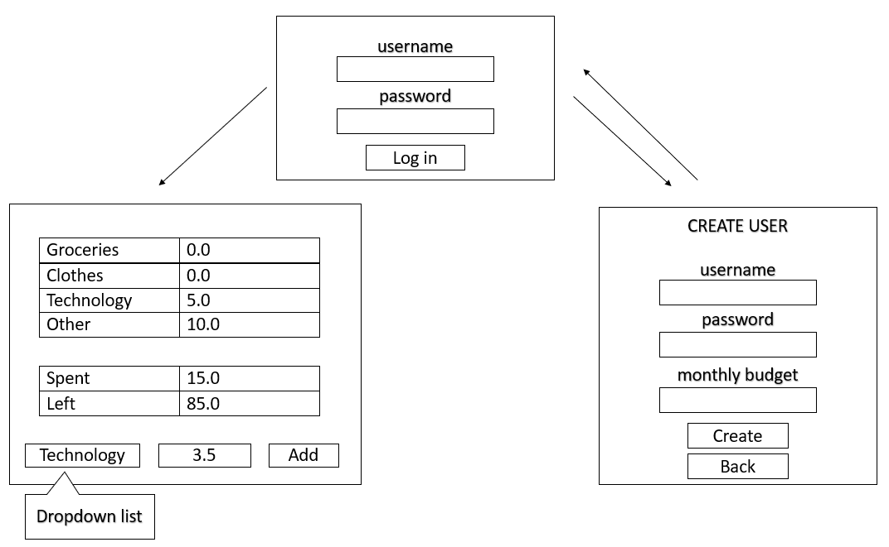

# Requirements specification

## Application purpose

The application is a tool for butgeting, where the users can track montly spendings. The user can set a monthly budget, add expences as different categories (e.g. groceries, clothes etc.) and track their monthly spendings. A user must, however, reset the application at the end of each month as this is not done automatically.

## User interface draft

## Basic functionality

### Before logging in (Done)

A user can:
- Create a new account by choosing a 
  - Username
  - Password
  - Monthly budget
- Navigate back to the log in view
  
### After logging in

Landing page displays:
- Total spendings
- Total left 
- Spendings per category 
- Option to add new spendings 
  - User chooses a category from a dropdown list and inserts amount in euros (integer or decimal)

## Additional ideas

Additional ideas include
- Option to request new password
- Visualisation of spendings on landing page
- Option to choose customized categories
