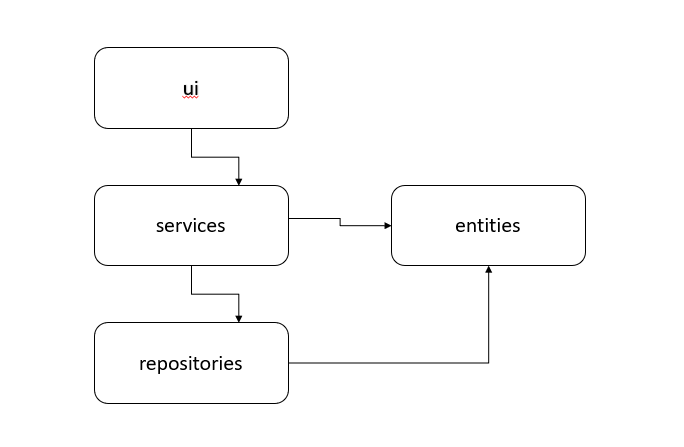
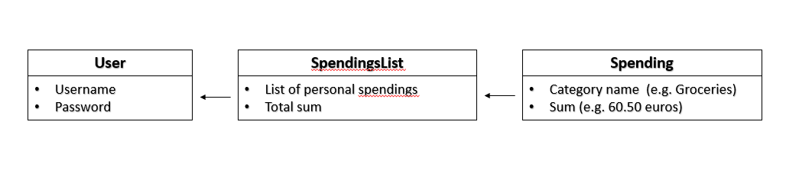
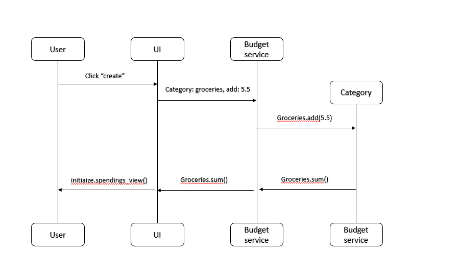

# Architecture description

## Folder structure

The application architecture follows this structure:

- UI handles user interface
- Services handles application logic
- Respositories handles data storage
- Entities classes managing information used in the application.

## User interface

The user interface will consist of three views:

- Login view
- User creation view
- Spendings/budget management view

## Application logic

The logical data models consist of the classes User, Category and CategoryList

## Main functionalities

The main application functionalities are illustrated below.

### User login

When the user inserts their username and a password to the displayed text fields and clicks _Log in_, the application proceeds as follows:

TBD

### User creation

When the user inserts a username that is not yet in use and a valid password and clicks "Create", the application runs as follows:

### Managing and creating spendings

When the user chooses a category and inserts a decimal number representing a spending (e.g. 4.5 euros spent on the category groceries) the application runs as follows:

TBD
