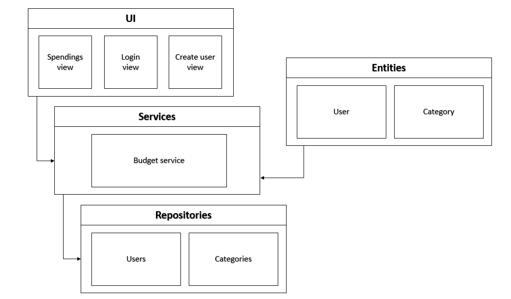
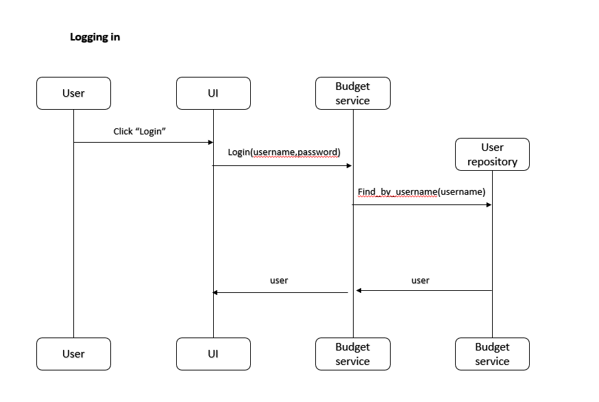
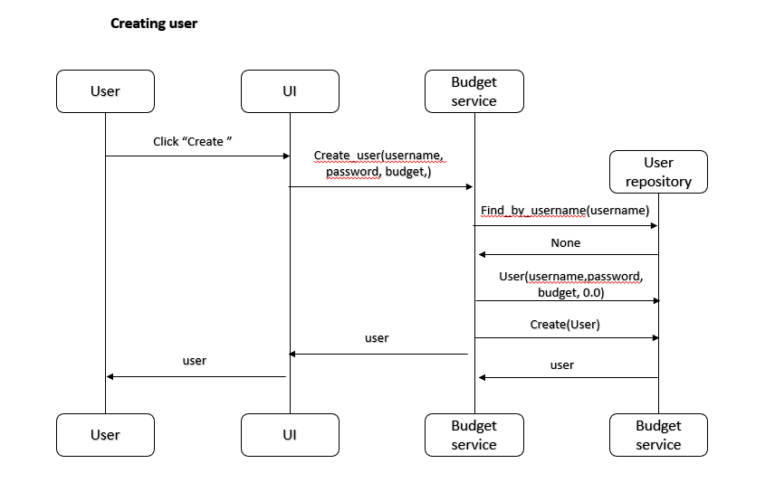
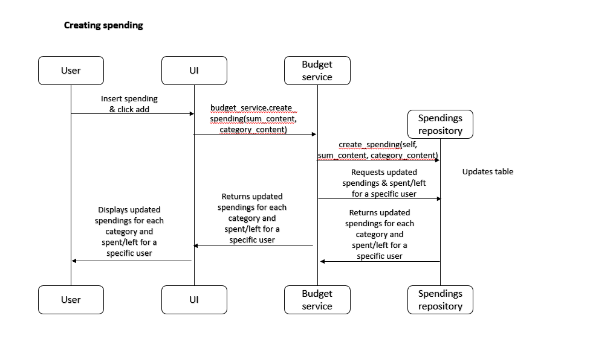

# Architecture description

## Folder structure

The application architecture follows this structure:

- UI handles user interface
- Services handles application logic
- Respositories handles data storage
- Entities classes managing information used in the application.

## User interface

The user interface will consist of three views:

- Login view
- User creation view
- Spendings/budget management view

## Application logic & data storage

The logical data models consist of the classes User, Category and CategoryList. The data is stored in two tables: users and categories.

## Main functionalities

The main application functionalities are illustrated below.

### User login

When the user inserts a username and a correct password that are stored in the database, and clicks "Log in", the application runs as follows:

### Creating user

When the user inserts a username that is not yet in use and a valid password and clicks "Create", the application runs as follows:

### Creating spendings

When the user chooses a category from the dropdown list, inserts a sum and clicks "Add" (e.g. 4.5 euros spent on the category groceries), the application runs as follows:

