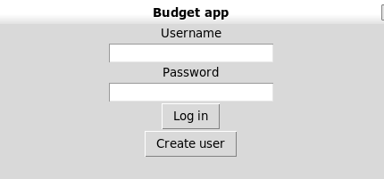
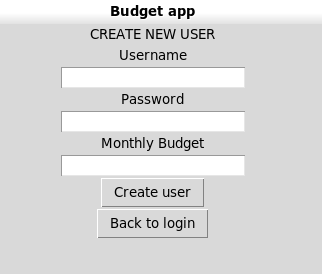
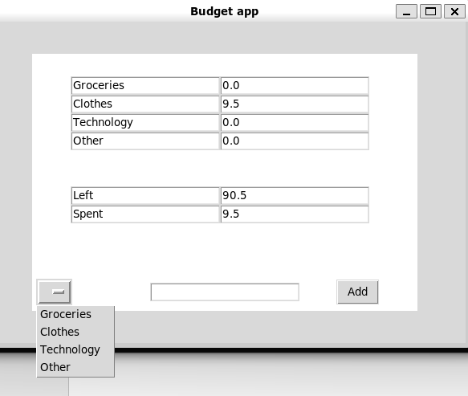

# User manual

Download the latest release.

## Starting the application

Run the following initial commands before starting the application:

```bash
poetry install
```

```bash
poetry run invoke build
```

Now start the application by running the following command:

```
poetry run invoke start
```

## Logging in



If you have created a user account, insert your username and password to the textfields in the image above.

If you have not already created a user account, clich "Create user"

## Creating a new user



Insert a username, password and a monthly budget to the textfields in the image above. 

The monthly budget shall represent how much you wish to spend while using the application.

## Tracking spendings



Choose a category from the dropdown list, insert the amount you spent on the purchase and click "Add".

The "Spent" field shows how much you have spent and the "Left" field shows how much you have left of your montly budget.
